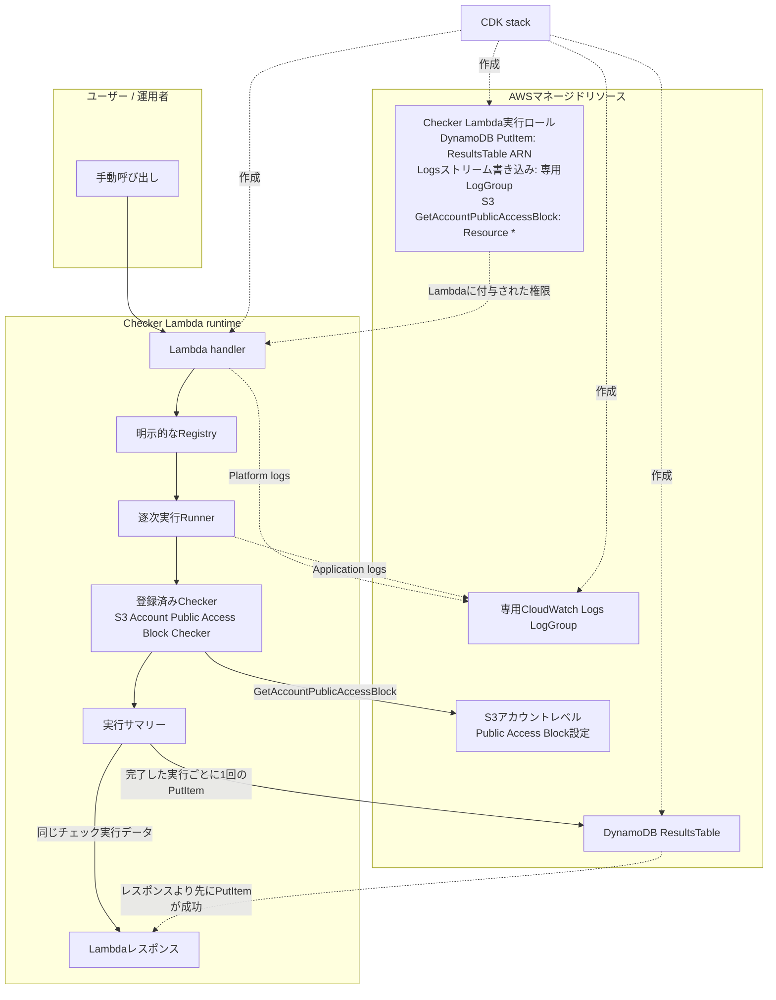

# AWS Security & Operations Checker

[English](README.md) | **日本語**

[ポートフォリオ概要](docs/portfolio-summary.ja.md)

## プロジェクト概要

AWS Security & Operations Checkerは、小規模なAWS環境や学習環境、対象を絞った設定レビューに使える、軽量でセルフホスト型の拡張可能なCheckerです。Lambda関数が明示的に登録されたCheckerを実行し、AWSの設定や運用上のリスクをチェックします。実行結果は集約してDynamoDBに保存します。

このプロジェクトは現在MVPです。あえて小さく、理解しやすい構成にしています。マネージドセキュリティサービスのような幅広い機能を提供するものではありません。

## 現在の機能

現在実装している機能は次のとおりです。

- Lambdaの手動呼び出し
- Registryへの登録順にCheckerを逐次実行
- `PASS`、`FAIL`、`ERROR`の結果ステータス
- 合計、PASS、FAIL、ERRORの件数を含む実行単位のサマリー
- Checkerの結果数にかかわらず、完了した実行ごとにDynamoDBアイテムを1件保存
- 結果スキーマはバージョン2
- S3 Account Public Access Block Checker
- CloudWatch LogsへのアプリケーションログとLambdaプラットフォームログの出力
- `dev`および`prod`論理環境向けのAWS CDK synth

UI、HTTP API、スケジュール実行、CI/CDパイプライン、マルチアカウント実行、自動修復はまだありません。

## 現在の標準Checker

S3 Account Public Access Block Checkerは、アカウントレベルのAmazon S3 Block Public Access設定を評価します。確認するのは次の4つの真偽値です。

- `BlockPublicAcls`
- `IgnorePublicAcls`
- `BlockPublicPolicy`
- `RestrictPublicBuckets`

判定ルールは次のとおりです。

- 4つの設定がすべて`true`の場合は`PASS`
- 1つ以上の設定が`false`の場合は`FAIL`
- アカウントレベルのPublic Access Block設定が存在しない場合は`FAIL`
- レスポンスがない、不完全、または形式が不正な場合は`ERROR`
- その他のAWS APIエラーにより評価できない場合は`ERROR`

4つの設定がすべて存在し、値が正しい場合、`details`には評価した真偽値だけを含めます。設定が存在しない場合やエラーの場合、結果に`details`は含めません。また、対象AWSアカウントのID、AWSリソースのARN、AWS APIの生レスポンス、リクエストID、例外メッセージは結果に保存しません。

## アーキテクチャ



Lambdaが同じチェック実行データを返すのは、DynamoDBの`PutItem`が成功した後だけです。現在のCheckerの結果はDynamoDBに保存します。現在のApplication Stackには、結果保存用のS3 Bucketはありません。

現在のstackの出力は`ProjectName`、`EnvironmentName`、`ResultsTableName`、`CheckerFunctionName`です。

## リポジトリ構成

```text
.
├── README.md
├── docs/
│   ├── adding-a-checker.md
│   └── test-records/
└── infra/
    ├── bin/                 # CDK application entry point
    ├── lambda/checker/      # Lambda entry point, framework, and Checkers
    ├── lib/config/          # Shared and environment configuration
    ├── lib/stacks/          # CDK stack definition
    ├── test/                # Jest/CDK and Python unittest suites
    ├── cdk.json
    ├── package.json
    └── package-lock.json
```

[`docs/requirements/project-foundation.md`](docs/requirements/project-foundation.md)には、プロジェクトの計画、要件、今後の方向性を記録しています。現在実装されている機能、制限事項、デプロイ、クリーンアップ手順については、このREADMEを正とします。

## 前提条件

以下が必要です。

- 自分で管理しているAWSアカウント
- そのアカウントにアクセスできるAWS CLI環境
- Node.jsとnpm
- 標準ライブラリの`unittest`モジュールを含むPython 3.12
- 生成されたCloudFormation stackのbootstrapとデプロイに必要な権限を持つAWS認証情報またはSSOプロファイル

デプロイするLambda runtimeはPython 3.12なので、ローカルでもPython 3.12を推奨します。公開済みの検証ではPython 3.12.13を使用しました。ロック済みの依存関係では、プロジェクト内のAWS CDK CLIが`2.1134.0`、`aws-cdk-lib`が`2.263.0`に解決されるため、例では`npx cdk`を使います。

ローカル環境のセットアップ、テスト、監査、AWS認証情報を使わないsynthは、機密情報を除いた以前の公開用スナップショットからNode.js `24.14.1`、npm `11.11.0`、AWS CLI `2.34.19`を使って再現済みです。この組み合わせは文書化した手順で検証したもので、最小対応バージョンを示すものではありません。過去のAWS再現検証と現在のHEADの違いについては、[検証状況](#検証状況)を参照してください。

デプロイすると、DynamoDB、Lambda、CloudWatch Logs、IAM、および関連するCloudFormation/CDKリソースが作成または更新されます。CDK bootstrap用のアセットはApplication Stackとは別の共有デプロイ基盤で、S3を使う場合があります。デプロイ前に、生成されたテンプレートとデプロイ権限を確認してください。

## インストール

リポジトリをクローンし、インフラディレクトリでロック済みのNode.js依存関係をインストールします。

```bash
cd infra
npm ci
```

`infra/package-lock.json`を管理しているため、依存関係を再現できる`npm ci`を推奨します。現在のローカル単体テストでは、Pythonパッケージを別途インストールする必要はありません。デプロイ先ではAWS提供の`boto3`を使います。このリポジトリでは、現時点でパッケージ化もバージョン固定もしていません。

## ローカル検証

`infra`ディレクトリで次のコマンドを実行します。

```bash
npm run build
npm run test:lambda
npm run test:cdk
npm test
```

- `npm run build`はTypeScriptの`noEmit`モードを使い、JavaScriptファイルを生成せずにCDKのソースコードを型チェックします。
- `npm run test:lambda`はCheckerのPythonソースコードとテストをコンパイルした後、Pythonの`unittest`テストスイートを実行します。
- `npm run test:cdk`は、IAMのスコープ確認を含むsynth済みのCDK construct modelに対してJestの検証を実行します。
- `npm test`はCDKのテストに続けてLambdaのテストを実行します。

現在のHEADに対するbuildとテストの最新結果は、すべて成功しています。synthの状況は別に記載します。

- TypeScriptビルド: 成功
- Jest/CDK: 48件のテストに成功
- Python: Python 3.12.13で39件のテストに成功
- dev synth: 現在のHEADについて、AWS認証情報を使わず、lookupを行わない条件で成功
- prod synth: 現在のHEADについて、AWS認証情報を使わず、lookupを行わない条件で成功

## CDK synth

CDKアプリケーションが対応する論理環境は`dev`と`prod`だけです。`env`のcontextでどちらかを明示的に選んでください。値がない場合や不正な場合はエラーになります。Account IDは12桁ちょうど、リージョンは空ではなく前後に空白を含まない値である必要があります。どちらもソースコードにはハードコードしていません。

`TARGET_AWS_ACCOUNT`と`TARGET_AWS_REGION`は、このプロジェクト独自の明示的overrideです。overrideが未定義の場合は、CDK CLIから渡される`CDK_DEFAULT_ACCOUNT`または`CDK_DEFAULT_REGION`へfallbackします。明示的overrideが空または不正な場合はfallbackせずfail closedし、リージョンの暗黙defaultもありません。どちらの入力元からも有効なAccount IDとリージョンを解決できなければsynthを停止します。

以下のコマンドにある`<AWS_PROFILE>`、`<ACCOUNT_ID>`、`<REGION>`、`<STACK_NAME>`などはプレースホルダーです。実行前に自分の環境の値へ置き換え、山括弧自体は含めないでください。

```bash
npx --no-install cdk synth -c env=dev --profile <AWS_PROFILE>
npx --no-install cdk synth -c env=prod --profile <AWS_PROFILE>
```

通常はAWSプロファイルからCDK CLIがAccount IDとリージョンを解決し、`CDK_DEFAULT_ACCOUNT`と`CDK_DEFAULT_REGION`としてアプリケーションへ渡します。現在のアプリケーションはAWS環境へのlookupを行いません。認証情報を使わないローカルsynthでは、プロファイルの代わりにプロジェクト独自のoverrideを使用します。

```bash
TARGET_AWS_ACCOUNT=<ACCOUNT_ID> \
TARGET_AWS_REGION=<REGION> \
npx --no-install cdk synth -c env=dev

TARGET_AWS_ACCOUNT=<ACCOUNT_ID> \
TARGET_AWS_REGION=<REGION> \
npx --no-install cdk synth -c env=prod
```

現在のHEADでは、AWS認証情報を使わず、lookupを行わない条件でdev / prod両方のsynthに成功しています。この検証では、`TARGET_AWS_REGION=ap-northeast-1`が、`us-east-1`を指定した`AWS_REGION`と`AWS_DEFAULT_REGION`より優先されることも確認しました。prodはデプロイもruntimeテストも行っていません。

## デプロイ

AWS IAM Identity Center（SSO）プロファイルを使う場合は、AWS環境を対象とするCDKの差分確認やデプロイの前にログインし、devのstackを確認します。

```bash
aws sso login --profile <AWS_PROFILE>
npx cdk ls -c env=dev --profile <AWS_PROFILE>
```

`cdk ls`が返したstack名を、以下のコマンドの`<STACK_NAME>`に使います。prodのstackを確認する場合は、`-c env=prod`を指定して`cdk ls`をもう一度実行します。

まだbootstrapしていないアカウントとリージョンへ初めてデプロイする場合は、先にCDK bootstrapが必要です。

```bash
npx cdk bootstrap \
  aws://<ACCOUNT_ID>/<REGION> \
  --profile <AWS_PROFILE>
```

デプロイ前にdevの変更内容を確認し、devのstackをデプロイします。

```bash
npx cdk diff <STACK_NAME> -c env=dev --profile <AWS_PROFILE>
npx cdk deploy <STACK_NAME> -c env=dev --profile <AWS_PROFILE>
```

生成されるリソースに必要なデプロイ権限だけを持つプロファイルを使ってください。変更を承認する前に、必ずsynth済みのテンプレートと`cdk diff`の出力を確認します。prodは別リリースとして扱い、デプロイを検討する前に、保持設定、権限、リソース置換のリスク、クリーンアップ手順、想定コストを確認してください。現在のHEADでは、AWS認証情報を使わないprodのローカルsynthに成功していますが、prodのデプロイとruntimeテストは行っていません。

## 手動呼び出し

デプロイ後は固定の物理名に依存せず、stackのCloudFormation出力である`CheckerFunctionName`からLambda関数名を取得します。

```bash
FUNCTION_NAME="$(
  aws cloudformation describe-stacks \
    --stack-name <STACK_NAME> \
    --query "Stacks[0].Outputs[?OutputKey=='CheckerFunctionName'].OutputValue | [0]" \
    --output text \
    --profile <AWS_PROFILE> \
    --region <REGION>
)"

aws lambda invoke \
  --function-name "$FUNCTION_NAME" \
  --payload '{}' \
  --cli-binary-format raw-in-base64-out \
  --profile <AWS_PROFILE> \
  --region <REGION> \
  lambda-response.json
```

AWS CLIは呼び出しのメタデータを表示し、Lambdaの戻り値を`lambda-response.json`へ書き込みます。戻り値には数値の`statusCode`と`body`フィールドがあります。`body`はJSONでエンコードされた文字列で、ネスト済みのJSONオブジェクトではありません。この文字列を1回パースすると、スキーマバージョン2のチェック実行結果を取得できます。

## CloudWatch Logsの検証

Checkerのロググループ名は、標準の`/aws/lambda/<FUNCTION_NAME>`です。呼び出し後、次のコマンドで最近のプラットフォームログとアプリケーションログを確認します。

```bash
aws logs tail "/aws/lambda/${FUNCTION_NAME}" \
  --since 10m \
  --profile <AWS_PROFILE> \
  --region <REGION>
```

設定されている保持期間は次のコマンドで確認できます。

```bash
aws logs describe-log-groups \
  --log-group-name-prefix "/aws/lambda/${FUNCTION_NAME}" \
  --query "logGroups[].{name:logGroupName,retentionDays:retentionInDays}" \
  --profile <AWS_PROFILE> \
  --region <REGION>
```

Lambdaのプラットフォームログには、呼び出しのリクエストIDなど、環境固有の識別子が含まれる場合があります。ログを公開する前に内容を確認し、必要な情報をマスキングしてください。

## 保存される結果

呼び出しが成功するたびに、集約したアイテムを1件DynamoDBへ書き込みます。スキーマバージョン2の概念的な例は次のとおりです。

```json
{
  "schemaVersion": 2,
  "resultId": "<generated-id>",
  "checkedAt": "<checked-at>",
  "envName": "<ENVIRONMENT>",
  "message": "Check run completed.",
  "summary": {
    "total": 1,
    "passCount": 1,
    "failCount": 0,
    "errorCount": 0
  },
  "results": [
    {
      "checkId": "s3-account-public-access-block",
      "checkName": "S3 Account Public Access Block",
      "status": "PASS",
      "severity": "MEDIUM",
      "message": "All account-level S3 Block Public Access settings are enabled.",
      "resourceId": "account",
      "checkedAt": "<checked-at>",
      "details": {
        "BlockPublicAcls": true,
        "IgnorePublicAcls": true,
        "BlockPublicPolicy": true,
        "RestrictPublicBuckets": true
      }
    }
  ]
}
```

DynamoDBのパーティションキーは`resultId`です。1回の実行に含まれるすべての結果には、正規化した同じ`checkedAt`の値を設定します。`FAIL`は評価結果のひとつなので、通常の成功時と同じ流れで保存します。DynamoDBへの保存に失敗した場合は、成功レスポンスを返さず、そのエラーを呼び出し元へ伝えます。

## IAMとセキュリティ

現在のChecker Lambda実行ロールでは、必要な権限をインラインポリシーに明示しています。

- DynamoDB: `dynamodb:PutItem`。対象はResultsTableのARNのみ
- CloudWatch Logs: `logs:CreateLogStream`および`logs:PutLogEvents`。対象はChecker専用LogGroupのみ
- S3: `s3:GetAccountPublicAccessBlock`、`Resource: "*"`

アカウントレベルのS3 APIは、Bucketなどのリソース単位で権限を絞れないため、`Resource: "*"`が必要です。S3の全actionを許可しているわけではなく、許可するS3 actionは`s3:GetAccountPublicAccessBlock`だけです。

このロールはAWS管理ポリシーの`AWSLambdaBasicExecutionRole`を使わず、`logs:CreateLogGroup`も付与しません。CDK stackがLambda関数より先に専用LogGroupを作るため、runtimeロールに必要なのは、そのLogGroup内でのログストリーム作成とイベント書き込みだけです。API側で絞り込みが可能な権限は対象を限定しつつ、アカウントレベルのS3チェックに必要な`Resource: "*"`は残しています。

Checkerが必要とするAWS API権限は、Checkerごとに明示的に追加する設計です。Checkerを追加するときに、既存のDynamoDB保存権限を広げてはいけません。対象APIが対応している場合は、必要なactionとリソースの範囲だけを指定します。

結果にはアカウントID、リソースARN、例外メッセージ、AWSの生レスポンス、リクエストIDを保存しません。Runnerのエラーログには例外メッセージを出さず、Checker ID、ステータス、例外の型だけを含めます。LambdaアセットからはPythonのバイトコードとキャッシュディレクトリを除外し、テストはアセットのソースディレクトリ外に置いています。

## 環境ごとの動作

現在の実装では、`dev`と`prod`を次のように区別しています。

| 項目 | `dev` | `prod` |
|---|---|---|
| 結果テーブルの削除ポリシー | Destroy | Retain |
| Checkerロググループの削除ポリシー | Destroy | Retain |
| CloudWatch Logsの保持期間 | 7日 | 30日 |

Lambda runtimeが受け付けるのは`ENV_NAME=dev`または`ENV_NAME=prod`だけです。runtimeの設定がない場合や不正な場合は、意図しない環境で実行せず、モジュール初期化時にエラーにします。

物理名には論理環境を含めます。テーブル名は、デプロイ先のアカウントとリージョンも使って一意になるようにしています。Lambda関数とロググループの名前には環境名を含めます。アカウントIDはソースコードにハードコードしておらず、特定のAWS CLIプロファイルに依存するコードもありません。

両環境とも、同じChecker実装、Python 3.12のLambda runtime、30秒のタイムアウト、128 MBのメモリ、DynamoDBのオンデマンド課金を使います。AWS実機で検証したApplication / Infrastructureのリビジョンは`d999670`です。このリビジョンは`dev`でのAWS実機デプロイとruntime検証に合格しました。ローカル検証では、AWS認証情報を使わないdev / prodのsynthにも成功し、生成した両方のテンプレートも最終ローカル検証に合格しています。prodはデプロイもruntimeテストも行っていません。

## コストに関する考慮事項

主な従量課金要素は次のとおりです。

- Lambdaの呼び出し回数と実行時間
- DynamoDBのオンデマンド書き込みと保存データ
- CloudWatch Logsへの取り込みと保持データ
- 各チェック実行で発生するS3 Control APIリクエスト
- アセット保存や関連リクエストなど、CDK bootstrapとデプロイの成果物

以下は2026-08-03時点の利用量ベースの試算で、`ap-northeast-1`のAWS公開料金を使っています。無料利用枠、クレジット、割引、税、無視できる程度のデータ転送は含めていません。月100回のChecker手動呼び出し、Lambdaメモリ128 MB、平均実行時間1秒、1回につき4 KiBのDynamoDBアイテムを1件書き込み、CloudWatch Logsを10 KiB出力する想定です。

| 環境 | 月額の概算 |
|---|---:|
| `dev` | 約USD 0.00136 |
| `prod` | 約USD 0.00138 |

どちらも月額USD 0.01未満です。Checkerのログは`dev`で7日間、`prod`で30日間保持します。CloudWatch Logsのストレージ計算では、圧縮率を保守的に1.0としています。

DynamoDBテーブルにはTTL設定がないため、保存データは増え続けます。4 KiBのアイテムを100件追加で保持するたびに、ストレージ料金が月額約USD 0.000109増えます。この試算には、CDK bootstrap用アセット、一時的なdeploy・update・destroyの料金、prodのstackをdestroyした後も残るリソースの継続料金は含めていません。アカウントレベルの`GetAccountPublicAccessBlock`リクエストも、公式AWS Price Listから課金対象のSKUを明確に特定できなかったため除外しています。

これらは概算で、実際の請求額を保証するものではありません。AWSの料金は変わる可能性があるため、デプロイ前に確認してください。詳しい[AWS利用量ベースのコスト試算](docs/test-records/2026-08-03-aws-cost-estimate.md)は過去時点の記録です。そこにあるResults Bucketとauto-delete providerの説明は現在のApplication Stackには当てはまりません。ただし、採用した継続料金の合計では、それらのコストをゼロとしているか、ライフサイクル処理の料金を除外しています。

## クリーンアップ

destroyの前に、対象のstack、contextの環境、プロファイル、保持データ、直近のdiffを確認してください。devの一般的なクリーンアップコマンドは次のとおりです。

```bash
npx cdk destroy <STACK_NAME> -c env=dev --profile <AWS_PROFILE>
```

`dev`では、結果テーブルとCheckerロググループをstackと一緒に削除する設定です。destroyはデータを削除する操作なので、実行前に重要なデータがないか確認してください。

`prod`では、結果テーブルとCheckerロググループを保持する設定です。そのため、stackをdestroyしてもデータを持つリソースが残る場合があります。残ったリソースは個別に確認し、必要なら後から手動で削除してください。これらのリソースには明示的な物理名があるため、同じ名前のリソースを作ろうとする再デプロイと競合する可能性があります。同じ環境へ再デプロイする前に、保持データと名前の競合を確認してください。CDK bootstrapリソースやその他のデプロイ成果物も別に確認が必要です。Application Stackをdestroyしても、AWSアカウントが閉鎖されたり、アカウントレベルのすべてのデータやリソースが消えたりするわけではありません。

## Checkerの追加

共通の結果形式、明示的な登録、AWSクライアントの注入、最小権限のIAM設定、テスト、検証手順については、[Checkerの追加](docs/adding-a-checker.md)を参照してください。

## 制限事項とロードマップ

以下は未実装、または未完了です。

- UIなし
- API Gatewayまたはその他のHTTP APIなし
- EventBridgeによるスケジュール実行なし
- CI/CDパイプラインなし
- マルチアカウント実行なし
- 自動修復なし
- 最新の実行を取得するための専用インデックスやアクセスパターンなし
- DynamoDB TTLなし
- 集約する結果が増えた場合のDynamoDBの400 KBアイテム上限への対応方針なし
- `boto3`のパッケージ化とバージョン固定なし。現在はLambda runtimeが提供するSDKを使用
- prodのデプロイとruntime検証は未実施。現在のHEADで確認済みなのは、AWS認証情報を使わないprodのローカルsynthまで

これらは今後の対応や検証項目であり、現在使える機能ではありません。

## 検証状況

機密情報を除いた以前の公開用スナップショットは、AWS上での再現検証に成功しています。この過去の検証では、devへのデプロイ、Lambdaの呼び出し1回、DynamoDBへの保存、CloudWatch Logs、IAM権限を確認しました。その後、別途クリーンアップを行い、Application Stackをdestroyしています。この記録はApplication / Infrastructureリビジョン`d999670`のAWS検証とは別のもので、`d999670`を検証した証拠としては扱いません。

AWS実機で検証したApplication / Infrastructureのリビジョンは`d999670`です。最終ローカル検証と、`dev`でのAWS実機デプロイ・runtime検証に合格しました。その後の変更は、この検証結果を記録するためのドキュメント更新だけで、検証対象のアプリケーションコードは変更していません。

検証後はdevのApplication Stackをdestroyし、Applicationリソースは残していません。CDK bootstrap基盤だけを意図的に保持し、asset bucketは空に戻しました。prodはこれまでデプロイもruntimeテストも行っていません。

現在の検証については[公開候補の最終AWS実機検証](docs/test-records/2026-08-08-final-release-candidate-aws-validation.md)、以前の再現検証後のクリーンアップについては別記録の[最終AWSクリーンアップ記録](docs/test-records/2026-08-08-aws-cleanup.md)を参照してください。

## AWSサービスとの関係

このプロジェクトは、AWS ConfigやAWS Security Hubの代わりになるものではありません。これらのサービスは、より幅広いマネージド機能を持ち、連携方法も異なります。このCheckerは、コンパクトなセルフホスト実装が向いている小規模環境、学習用途、対象を絞ったカスタムチェックを目的としています。詳しい比較は、[AWSのセキュリティ・ガバナンスサービスとの関係](docs/aws-service-comparison.md)を参照してください。

## 検証記録

公開済みの検証記録はリポジトリ内で確認できます。

- [初回devデプロイとLambda検証](docs/test-records/2026-07-03-dev-deploy-and-lambda-test.md)
- [DynamoDB PutItemの最小権限検証](docs/test-records/2026-08-01-dynamodb-putitem-least-privilege.md)
- [S3 Account Public Access Block Checkerの検証](docs/test-records/2026-08-02-s3-account-public-access-block-checker.md)
- [CDK依存関係のセキュリティ更新検証](docs/test-records/2026-08-02-cdk-dependency-security-update.md)
- [CDK feature flag設定の検証](docs/test-records/2026-08-02-cdk-feature-flags.md)
- [TypeScript no-emitとJestモジュール解決の検証](docs/test-records/2026-08-02-typescript-noemit-jest-resolution.md)
- [公開用スナップショットのローカル再現検証](docs/test-records/2026-08-02-public-snapshot-local-reproduction.md)
- [公開用スナップショットのAWS再現検証](docs/test-records/2026-08-03-public-snapshot-aws-reproduction.md)
- [AWS利用量ベースのコスト試算](docs/test-records/2026-08-03-aws-cost-estimate.md)
- [AWS環境の最終クリーンアップ](docs/test-records/2026-08-08-aws-cleanup.md)
- [公開候補の最終AWS実機検証](docs/test-records/2026-08-08-final-release-candidate-aws-validation.md)
