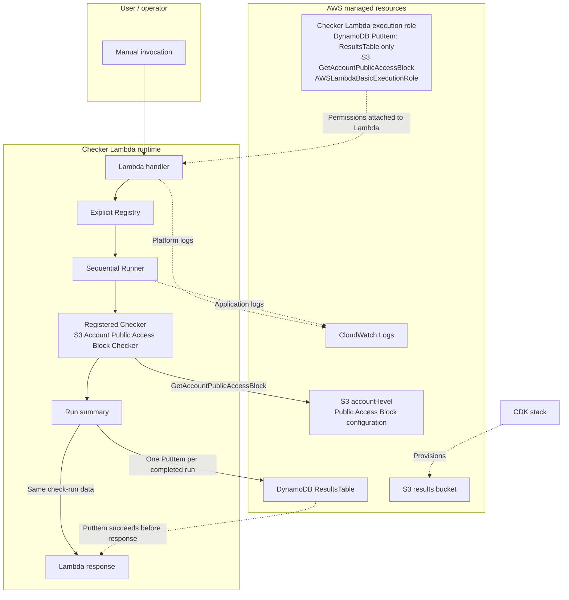

# AWS Security & Operations Checker

## Project overview

AWS Security & Operations Checker is a lightweight, self-hosted, and extensible checker for small AWS environments, learning environments, and focused configuration reviews. A Lambda function runs explicitly registered Checkers to evaluate selected AWS configuration and operational risks, summarizes the results, and stores the completed run in DynamoDB.

The project is currently an MVP. It is intentionally small and understandable, and it does not try to provide the breadth of a managed security service.

## Current functionality

The current implementation provides:

- Manual Lambda invocation
- Sequential execution of registered Checkers in registry order
- `PASS`, `FAIL`, and `ERROR` result statuses
- One run-level summary containing total, pass, fail, and error counts
- One DynamoDB item per completed check run, regardless of the number of Checker results
- Result schema version 2
- The S3 Account Public Access Block Checker
- Application and Lambda platform logging in CloudWatch Logs
- AWS CDK synthesis for the `dev` and `prod` logical environments

There is currently no UI, HTTP API, schedule, CI/CD pipeline, multi-account execution, or automatic remediation.

## Current standard checker

The S3 Account Public Access Block Checker evaluates the account-level Amazon S3 Block Public Access configuration. It checks these four Boolean settings:

- `BlockPublicAcls`
- `IgnorePublicAcls`
- `BlockPublicPolicy`
- `RestrictPublicBuckets`

The decision rules are:

- `PASS` when all four settings are `true`
- `FAIL` when one or more settings are `false`
- `FAIL` when no account-level Public Access Block configuration exists
- `ERROR` when the response is missing, incomplete, or malformed
- `ERROR` when another AWS API failure prevents evaluation

When all four settings are present and valid, `details` contains only those evaluated Boolean values. Missing configuration and error results omit `details`. Results do not store the target AWS account ID, an AWS resource ARN, the raw AWS API response, request identifiers, or exception text.

## Architecture



The Lambda returns the same check-run data only after the DynamoDB `PutItem` succeeds. Current Checker results are stored in DynamoDB. The S3 results bucket is provisioned by the CDK stack but is not part of the current result path. Its future role is not finalized.

## Repository structure

```text
.
├── README.md
├── docs/
│   ├── adding-a-checker.md
│   └── test-records/
└── infra/
    ├── bin/                 # CDK application entry point
    ├── lambda/checker/      # Lambda entry point, framework, and Checkers
    ├── lib/config/          # Shared and environment configuration
    ├── lib/stacks/          # CDK stack definition
    ├── test/                # Jest/CDK and Python unittest suites
    ├── cdk.json
    ├── package.json
    └── package-lock.json
```

[`docs/requirements/project-foundation.md`](docs/requirements/project-foundation.md) records project plans, requirements, and future direction. This README is the source of truth for currently implemented functionality, limitations, deployment, and cleanup procedures.

## Prerequisites

You need:

- An AWS account that you control
- AWS CLI access to that account
- Node.js and npm
- Python 3.12 with the standard-library `unittest` module
- AWS credentials or an SSO profile with the permissions required to bootstrap and deploy the generated CloudFormation stack

The deployed Lambda runtime is Python 3.12, so Python 3.12 is the recommended local version. Public validation used Python 3.12.13. The locked dependency tree currently resolves the project-local AWS CDK CLI to `2.1134.0` and `aws-cdk-lib` to `2.263.0`, so the examples use `npx cdk`.

Local setup, tests, audits, and credential-isolated synthesis were reproduced from a sanitized snapshot with Node.js `24.14.1`, npm `11.11.0`, and AWS CLI `2.34.19`. This is a validated combination for the documented local workflow, not a declaration of minimum supported versions. AWS deployment and runtime verification were not reproduced as part of this validation.

Deployment creates or updates S3, DynamoDB, Lambda, CloudWatch Logs, IAM, and supporting CloudFormation/CDK resources. Review the generated template and your deployment permissions before deploying.

## Installation

Clone the repository, then install the locked Node.js dependency tree from the infrastructure directory:

```bash
cd infra
npm ci
```

`npm ci` is recommended because `infra/package-lock.json` is tracked and provides a reproducible dependency installation. No separate Python package installation is required for the current local unit tests. The deployed runtime uses the AWS-provided `boto3`; it is not currently packaged or pinned by this repository.

## Local validation

Run these commands from `infra`:

```bash
npm run build
npm run test:lambda
npm run test:cdk
npm test
```

- `npm run build` uses TypeScript `noEmit` mode to type-check the CDK source without generating JavaScript files.
- `npm run test:lambda` compiles the Checker Python source and tests, then runs the Python `unittest` suite.
- `npm run test:cdk` runs the Jest assertions against the synthesized CDK construct model, including IAM scope checks.
- `npm test` runs the CDK test suite followed by the Lambda test suite.

## CDK synthesis

The CDK application supports only the `dev` and `prod` logical environments. Select one explicitly with the `env` context value. The application requires `CDK_DEFAULT_ACCOUNT`; an AWS profile normally supplies the account and region context. If no region is supplied, the application defaults to `ap-northeast-1`.

In all command examples below, values in angle brackets, such as `<AWS_PROFILE>`, `<ACCOUNT_ID>`, `<REGION>`, and `<STACK_NAME>`, are placeholders. Replace each placeholder with the value for your environment before running the command, and do not include the angle brackets themselves.

```bash
npx cdk synth -c env=dev --profile <AWS_PROFILE>
npx cdk synth -c env=prod --profile <AWS_PROFILE>
```

The current application performs no AWS environment lookups. For credential-isolated synthesis, provide non-sensitive context values directly instead of a profile:

```bash
CDK_DEFAULT_ACCOUNT=<ACCOUNT_ID> CDK_DEFAULT_REGION=<REGION> npx cdk synth -c env=dev
CDK_DEFAULT_ACCOUNT=<ACCOUNT_ID> CDK_DEFAULT_REGION=<REGION> npx cdk synth -c env=prod
```

Both logical environments have been synthesized during validation. Production has not been deployed or runtime-tested.

## Deployment

For an AWS IAM Identity Center (SSO) profile, authenticate and list the development stack before running an AWS-facing CDK comparison or deployment:

```bash
aws sso login --profile <AWS_PROFILE>
npx cdk ls -c env=dev --profile <AWS_PROFILE>
```

Use the stack name returned by `cdk ls` as `<STACK_NAME>` in the commands below. Repeat `cdk ls` with `-c env=prod` when reviewing the production stack.

CDK bootstrap is required before the first deployment to an account and region that have not already been bootstrapped:

```bash
npx cdk bootstrap \
  aws://<ACCOUNT_ID>/<REGION> \
  --profile <AWS_PROFILE>
```

Review the development change set before deployment, then deploy the development stack:

```bash
npx cdk diff <STACK_NAME> -c env=dev --profile <AWS_PROFILE>
npx cdk deploy <STACK_NAME> -c env=dev --profile <AWS_PROFILE>
```

Use a profile with only the deployment permissions needed for the generated resources. Always inspect the synthesized template and `cdk diff` output before approving changes. Treat production as a separate release: review its retention behavior, permissions, replacement risks, cleanup plan, and expected cost before considering a production deployment. The existing public validation covers production synthesis only.

## Manual invocation

After deployment, obtain the Lambda function name from the stack's `CheckerFunctionName` CloudFormation output instead of depending on a fixed physical name:

```bash
FUNCTION_NAME="$(
  aws cloudformation describe-stacks \
    --stack-name <STACK_NAME> \
    --query "Stacks[0].Outputs[?OutputKey=='CheckerFunctionName'].OutputValue | [0]" \
    --output text \
    --profile <AWS_PROFILE> \
    --region <REGION>
)"

aws lambda invoke \
  --function-name "$FUNCTION_NAME" \
  --payload '{}' \
  --cli-binary-format raw-in-base64-out \
  --profile <AWS_PROFILE> \
  --region <REGION> \
  lambda-response.json
```

The AWS CLI prints invocation metadata and writes the Lambda return value to `lambda-response.json`. The return value has a numeric `statusCode` and a `body` field. `body` is a JSON-encoded string, not an already nested JSON object; parse that string once to obtain the schema-version-2 check run.

## CloudWatch Logs verification

The Checker log group uses the standard `/aws/lambda/<FUNCTION_NAME>` name. After an invocation, inspect recent platform and application logs with:

```bash
aws logs tail "/aws/lambda/${FUNCTION_NAME}" \
  --since 10m \
  --profile <AWS_PROFILE> \
  --region <REGION>
```

Confirm the configured retention period with:

```bash
aws logs describe-log-groups \
  --log-group-name-prefix "/aws/lambda/${FUNCTION_NAME}" \
  --query "logGroups[].{name:logGroupName,retentionDays:retentionInDays}" \
  --profile <AWS_PROFILE> \
  --region <REGION>
```

Lambda platform logs can contain invocation request IDs and other environment-specific identifiers. Review and redact log output before publishing it.

## Stored result

Each successful invocation writes one aggregate item to DynamoDB. A conceptual schema-version-2 item looks like this:

```json
{
  "schemaVersion": 2,
  "resultId": "<generated-id>",
  "checkedAt": "<checked-at>",
  "envName": "<ENVIRONMENT>",
  "message": "Check run completed.",
  "summary": {
    "total": 1,
    "passCount": 1,
    "failCount": 0,
    "errorCount": 0
  },
  "results": [
    {
      "checkId": "s3-account-public-access-block",
      "checkName": "S3 Account Public Access Block",
      "status": "PASS",
      "severity": "MEDIUM",
      "message": "All account-level S3 Block Public Access settings are enabled.",
      "resourceId": "account",
      "checkedAt": "<checked-at>",
      "details": {
        "BlockPublicAcls": true,
        "IgnorePublicAcls": true,
        "BlockPublicPolicy": true,
        "RestrictPublicBuckets": true
      }
    }
  ]
}
```

The DynamoDB partition key is `resultId`. All results in one run receive the same normalized `checkedAt` value. A `FAIL` is an evaluated finding and is still stored through the normal successful application path. A persistence failure is propagated instead of returning a successful application response.

## IAM and security

The current Checker Lambda execution role has:

- `dynamodb:PutItem` scoped to the ResultsTable only
- `s3:GetAccountPublicAccessBlock` with `Resource: "*"`
- The AWS-managed `AWSLambdaBasicExecutionRole` policy for CloudWatch Logs

`Resource: "*"` is required by the account-level S3 API because that operation does not support a bucket or other resource-level scope. It does not grant wildcard S3 actions: the only allowed S3 action is `s3:GetAccountPublicAccessBlock`.

The design adds each Checker's required AWS API permissions explicitly. Adding a Checker must not broaden the existing DynamoDB persistence permission and should use exact actions and resource scopes wherever the target API supports them.

The implementation avoids storing account IDs, resource ARNs, exception text, raw AWS responses, and request identifiers in results. Runner error logs contain the Checker ID, status, and exception type rather than exception text. The Lambda asset excludes Python bytecode files and cache directories, and the tests are outside the asset source directory.

The results bucket blocks all public access and uses S3-managed encryption. These controls apply to the bucket even though current Checker results are stored in DynamoDB.

## Environment behavior

The implementation currently distinguishes `dev` and `prod` as follows:

| Behavior | `dev` | `prod` |
|---|---|---|
| Results bucket removal policy | Destroy | Retain |
| Results bucket object auto-deletion | Enabled | Disabled |
| Results table removal policy | Destroy | Retain |
| Checker log group removal policy | Destroy | Retain |
| CloudWatch Logs retention | 7 days | 30 days |

Physical names include the logical environment. Bucket and table names also derive uniqueness from the deployment account and region; the Lambda function and its log group include the environment. No source code is tied to a particular account or AWS CLI profile.

Both environments use the same current Checker implementation, Lambda runtime, timeout, memory, DynamoDB on-demand billing mode, S3 encryption, and S3 public-access controls. Development deployment and runtime behavior have been validated. Production has only been synthesized.

## Cost considerations

The main usage-dependent cost sources are:

- Lambda invocations and execution duration
- DynamoDB on-demand writes and stored result data
- CloudWatch Logs ingestion and retained log data
- The S3 Control API request made by each check run
- Storage and requests for the stack's S3 results bucket, although current Checker results are not written there
- CDK bootstrap and deployment artifacts, such as asset storage and related requests

The quantity-based estimate below is dated 2026-08-03 and uses AWS public pricing for `ap-northeast-1`. It excludes the Free Tier, credits, discounts, tax, and negligible data transfer. It assumes 100 manual Checker invocations per month, 128 MB of Lambda memory, a one-second average duration, one 4 KiB DynamoDB item written per invocation, 10 KiB of CloudWatch Logs per invocation, and no result objects stored in the results bucket.

| Environment | Estimated monthly cost |
|---|---:|
| `dev` | Approximately USD 0.00136 |
| `prod` | Approximately USD 0.00138 |

Both estimates are less than USD 0.01 per month. `dev` retains Checker logs for 7 days and `prod` for 30 days. The CloudWatch Logs storage calculation conservatively uses a compression ratio of 1.0.

The DynamoDB table has no TTL configuration, so stored data accumulates. Each additional retained set of 100 items at 4 KiB per item adds approximately USD 0.000109 per month in storage cost. The estimates do not include CDK bootstrap assets, transient deploy, update, or destroy costs, or continuing costs for resources retained after a production stack destroy. The account-level `GetAccountPublicAccessBlock` request is also excluded because its billable SKU could not be determined conclusively from the official AWS Price List.

These values are estimates rather than guaranteed charges. AWS pricing can change, so recheck it before deployment. See the [AWS quantity-based cost estimate](docs/test-records/2026-08-03-aws-cost-estimate.md) for pricing sources, SKUs, exact calculations, and exclusions.

## Cleanup

Confirm the target stack, context environment, profile, retained data, and recent diff before destroying anything. A general development cleanup command is:

```bash
npx cdk destroy <STACK_NAME> -c env=dev --profile <AWS_PROFILE>
```

In `dev`, the results bucket, its objects, the results table, and the Checker log group are configured for removal with the stack. Review important data before destruction because this is intentionally destructive.

In `prod`, the results bucket, results table, and Checker log group use retention policies, and bucket object auto-deletion is disabled. A stack destroy can therefore leave retained data-bearing resources that require explicit manual review and, if appropriate, later cleanup. These resources use explicit physical names, so retained resources can conflict with a later deployment that attempts to create resources with the same names. Resolve retained data and naming conflicts deliberately before redeploying the same environment. Also review CDK bootstrap resources and other deployment artifacts separately. Never assume that destroying the application stack closes an AWS account or removes every account-level artifact.

## Adding another checker

See [Adding a Checker](docs/adding-a-checker.md) for the shared result contract, explicit registration, AWS client injection, least-privilege IAM work, tests, and validation workflow.

## Limitations and roadmap

The following are not implemented or not yet completed:

- No user interface
- No API Gateway or other HTTP API
- No EventBridge schedule
- No CI/CD pipeline
- No multi-account execution
- No automatic remediation
- No dedicated index or access pattern for retrieving the latest run
- No DynamoDB TTL
- No handling strategy for DynamoDB's 400 KB item limit as aggregate result sets grow
- No packaged and pinned `boto3` version; the Lambda currently uses the runtime-provided SDK
- No clean-environment reproduction of AWS deployment and runtime verification; the sanitized snapshot has been validated only through local setup, tests, audits, and credential-isolated synthesis
- No production deployment or runtime validation

These are roadmap or validation items, not current capabilities.

## Relationship to AWS services

This project is not a replacement for AWS Config or AWS Security Hub. Those services have broader managed capabilities and different integration models. This checker is intended for small environments, learning, and focused custom checks where a compact self-hosted implementation is useful. See [Relationship to AWS Security and Governance Services](docs/aws-service-comparison.md) for a detailed, source-based comparison.

## Validation records

Public validation records are available in the repository:

- [Initial development deployment and Lambda validation](docs/test-records/2026-07-03-dev-deploy-and-lambda-test.md)
- [DynamoDB PutItem least-privilege validation](docs/test-records/2026-08-01-dynamodb-putitem-least-privilege.md)
- [S3 Account Public Access Block Checker validation](docs/test-records/2026-08-02-s3-account-public-access-block-checker.md)
- [CDK dependency security update validation](docs/test-records/2026-08-02-cdk-dependency-security-update.md)
- [CDK feature flag configuration validation](docs/test-records/2026-08-02-cdk-feature-flags.md)
- [TypeScript no-emit and Jest module resolution validation](docs/test-records/2026-08-02-typescript-noemit-jest-resolution.md)
- [Public snapshot local reproduction validation](docs/test-records/2026-08-02-public-snapshot-local-reproduction.md)
- [AWS quantity-based cost estimate](docs/test-records/2026-08-03-aws-cost-estimate.md)
